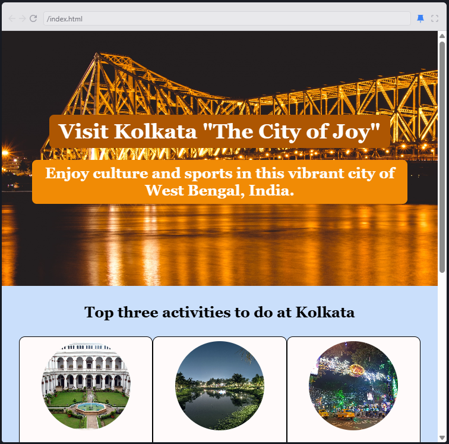

# 🏙️ Hometown Homepage – Kolkata 🇮🇳  
A beautifully crafted **homepage dedicated to Kolkata**, built with **HTML and CSS**. This project showcases the rich culture, heritage, and charm of the **City of Joy**. 🌇✨  

## 🎨 Features  
- **Elegant & Minimal Design** – Aesthetic layout with a Kolkata theme.  
- **Landmark Highlights** – Showcases famous places like Howrah Bridge, Victoria Memorial, and more.  
- **Cultural Essence** – Includes information on festivals, cuisine, and traditions.  
- **Fully Responsive** – Optimized for desktop and mobile viewing.  

## 🛠️ Technologies Used  
- **HTML** – For structuring the content.  
- **CSS** – For styling and responsive design.  

## 📸 Preview  
Here's how the **Hometown Homepage – Kolkata** looks:  
  
## 🚀 Getting Started  
1. **Clone the repository:**  
   ```bash
   git clone https://github.com/SaketXPrasad/hometown-homepage.git  
   ```  
2. **Navigate into the project folder:**  
   ```bash
   cd kolkata-hometown-homepage  
   ```  
3. **Open the website in your browser:**  
   ```bash
   open index.html  
   ```  

## 🎭 Customization  
- Add **your favorite places in Kolkata** to `index.html`.  
- Modify **colors and fonts** in the CSS file.  
- Include **personal memories or local recommendations**.  

## 🌟 Future Enhancements  
- **Interactive Map** – Highlight locations with descriptions.  
- **Photo Gallery** – Showcase Kolkata’s beauty through images.  
- **Blog Section** – Share stories, travel guides, or history.  

## 🙌 Contributions  
Want to contribute? Feel free to **fork**, **open issues**, or submit **pull requests**!  

## 📩 Contact  
**Project Maintainer:** Saket Prasad  
**Email:** saketxprasad@gmail.com  

🏡 **Thank you for visiting the Kolkata Hometown Homepage! Hope you love the City of Joy as much as I do!** ❤️  
